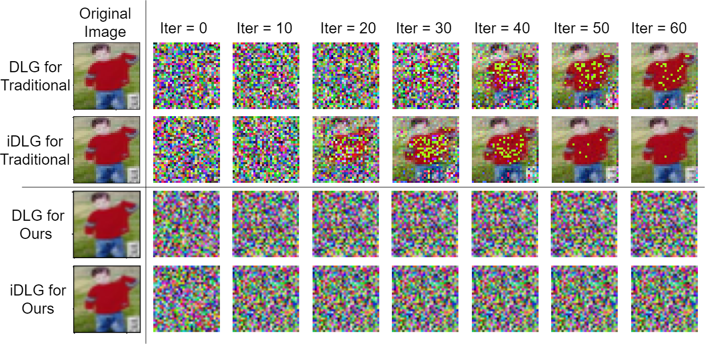

# Privacy Preservation Validation 

This repository contains the codes for the experiments that conducted to identify the privacy-violations that can be happened in traditional federated learning and our method.

This code used the implementation given in [1].

Sample output of this experiment is shown below. 

## References

[1] Zhao, Bo, Konda Reddy Mopuri, and Hakan Bilen. "idlg: Improved deep leakage from gradients." arXiv preprint arXiv:2001.02610 (2020).